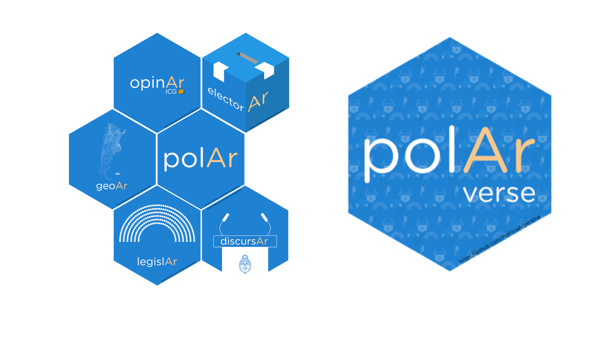

## Abstract

`{polAr}` nació como un paquete que buscaba facilitar el acceso y herramientas para el análisis de datos electorales en Argentina [@ruiznicolini2020]. El 16 de mayo de 2020 el proyecto en desarrollo viajaba a los servidores del *Comprehensive R Archive Network* (CRAN)[^1]. Con el tiempo se fueron integrando otros flujos de trabajo y fuentes de datos (geográficos, discursos presidenciales o votaciones legislativas), con un correlativo incremento de dependencias y dificultad de administrar cada vez más funciones.\
\
En octubre de 2020, durante el panel *Desarrollo de Paquetes* del III LatinR[^2], se nos consultó sobre estrategias para la administración, desarrollo y mantenimiento de paquetes; y, particularmente, sobre qué hacer cuando un paquete crece mucho. Sí esa discusión sembró la semilla del *'polArverse'*, la decisión de archivar `{polAr}` de CRAN abrió una ventana de oportunidad de avanzar en un proyecto ambicioso y extenso, pero compuesto por pequeños módulos. Un universo de paquetes para la política Argentina: divide y reinarás.

[^1]: *"is a collection of sites which carry identical material, consisting of the R distribution(s), the contributed extensions, documentation for R, and binaries" <https://CRAN.R-project.org/>*

[^2]: LatinR 2020 - Viernes 9 de Octubre - *Desarrollo de paquetes:* <https://www.youtube.com/watch?v=UYvSv8StDa8&t=10872s>

```{r, echo = FALSE, out.width="60%", fig.align="center"}


```

### *polArverse:* un universo de paquetes en desarrollo

El objetivo de la partición de `{polAr}` en un conjunto de paquetes más pequeños es brindar una multiplicidad de herramientas para el análisis político de Argentina, al tiempo de facilitar la administración, mantenimiento y crecimiento de los posibles flujos de trabajo que lo integran. Hasta el momento *polArverse* esta compuesto por:

-   **`{geoAr}`** - que facilita el acceso a geometrías de Argentina a distintos niveles (provincias, departamentos, radios censales), el diseño de grillas como si fueran mapas (para usar con `geofacet`) y otras herramientas para el trabajo *geo.*

-   **`{electorAr}`** - que facilita el acceso a datos electorales de Argentina y **`{legislAr}`** - para datos de votaciones en las cámaras legislativas de Argentina-, ambos basados en el trabajo previo de Andy Tow[^3].

-   **`{opinAr}`** - que facilita el acceso a datos de opinión pública del *Indice de Confianza en el Gobierno*[^4] y herramientas para trabajar con ellos.


[^3]: Para `{electorAr}` utilizamos bases de datos y tablas disponibles en el [*Atlas Electora*l](https://www.andytow.com/access/index.php). Para `{legislAr}` utilizamos los datos compartidos en el proyecto [*Década Votada*](https://decadavotada.andytow.com/doc.html)*.*

[^4]: Escuela de Gobierno. Universidad Torcuato Di Tella www.utdt.edu/icg

El trabajo en progreso cuenta además con tres paquetes más:\

- **`{discursAr}`** es un paquete aún en desarrollo que procura facilitar el acceso a discursos presidenciales. Además de los discursos de inauguración de sesiones que integraban la vieja versión disponible en `{polAr}`, en este paquete se está trabajando sobre discursos de gestión de presidentes contemporáneos. 

Se está avanzando además en el desarrollo de otros dos paquetes auxiliares:

-  **`{polArViz}`** : un paquete que incluye todas las funciones de visualización de datos del resto de los paquetes;

-  **`{polArverse}`:** el meta paquete que permite el acceso a todo el universo **polAr** al mismo tiempo.


```{r}
library(polArverse)

```

------------------------------------------------------------------------

### Referencias
