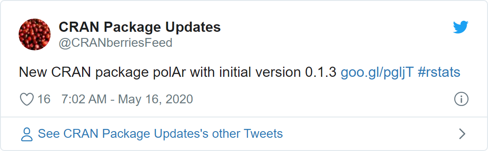

## Abstract

`{polAr}` nació como un paquete que buscaba facilitar el acceso y herramientas para el análisis de datos electorales en Argentina [@ruiznicolini2020]. El 16 de mayo de 2020 el proyecto en desarrollo viajaba a los servidores del [*Comprehensive R Archive Network* (CRAN)](https://cran.r-project.org/). Con el tiempo se fueron integrando otros flujos de trabajo y fuentes de datos (geográficos, discursos presidenciales o votaciones legislativas), con un correlativo incremento de dependencias y dificultad de administrar cada vez más funciones.

```{r, echo=FALSE, include=FALSE, eval = FALSE}

library(tweetrmd)

tweet_screenshot(tweet_url("CRANberriesFeed", "1261597845808975872"))

```


```{r, echo = FALSE, out.width="80%", fig.align="center"}




```


En octubre de 2020, durante el panel *Desarrollo de Paquetes* del III LatinR[^2], se nos consultó sobre estrategias para la administración, desarrollo y mantenimiento de paquetes; y, particularmente, sobre qué hacer cuando un paquete crece mucho. Sí esa discusión sembró la semilla del *'polArverse'*, [la decisión de CRAN de archivar `{polAr}`](https://twitter.com/TuQmano/status/1365620872397152259) abrió una ventana de oportunidad de avanzar en un proyecto ambicioso y extenso, pero compuesto por pequeños módulos. Un universo de paquetes para la política Argentina: divide y reinarás.


[^2]: LatinR 2020 - Viernes 9 de Octubre - *Desarrollo de paquetes:* <https://www.youtube.com/watch?v=UYvSv8StDa8&t=10872s>

```{r, echo = FALSE, out.width="70%", fig.align="center"}
knitr::include_graphics("images/polarverse.png")

```

### *polArverse:* un universo de paquetes en desarrollo[^3]

[^3]: Se está avanzando además en el desarrollo de un segundo paquete auxiliar, `{polArViz}`, que incluye todas funciones de visualización de datos del resto de los paquetes.

El objetivo de la partición de [`{polAr}`](https://github.com/electorArg/polAr) en un conjunto de paquetes más pequeños es brindar una multiplicidad de herramientas para el análisis político de Argentina, al tiempo de facilitar la administración, mantenimiento y crecimiento de los posibles flujos de trabajo que lo integran. 

Hasta el momento [*polArverse*](https://github.com/PoliticaArgentina/polArverse) esta compuesto por:

-   **`{geoAr}`** - que facilita el acceso a geometrías de Argentina a distintos niveles (provincias, departamentos, radios censales), el diseño de grillas como si fueran mapas (para usar con `geofacet`) y otras herramientas para el trabajo *geo.*

-   **`{electorAr}`** - que facilita el acceso a datos electorales de Argentina y **`{legislAr}`** - para datos de votaciones en las cámaras legislativas de Argentina-, ambos basados en el trabajo previo de Andy Tow[^4].

-   **`{opinAr}`** - que facilita el acceso a datos de opinión pública del *Indice de Confianza en el Gobierno*[^5] y herramientas para trabajar con ellos.

[^4]: Para `{electorAr}` utilizamos bases de datos y tablas disponibles en el [*Atlas Electora*l](https://www.andytow.com/access/index.php). Para `{legislAr}` utilizamos los datos compartidos en el proyecto [*Década Votada*](https://decadavotada.andytow.com/doc.html)*.*

[^5]: Escuela de Gobierno. Universidad Torcuato Di Tella www.utdt.edu/icg

```{=html}
<!-- -->
```
-   **`{discursAr}`** es un paquete aún en desarrollo que procura facilitar el acceso a discursos presidenciales. Además de los discursos de inauguración de sesiones que integraban la vieja versión disponible en `{polAr}`, en este paquete se está trabajando sobre discursos de gestión de presidentes contemporáneos.

Por último **`{polArverse}`**, basado en la idea y código de \CRANpkg{tidyverse}, es un meta paquete auxiliar que permite el acceso a todo el universo **polAr** al mismo tiempo.

```{r}
library(polArverse)

```

------------------------------------------------------------------------

### Referencias
